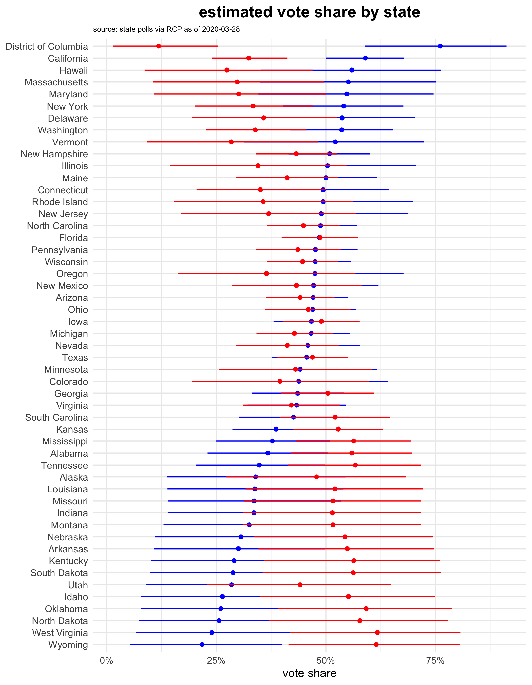
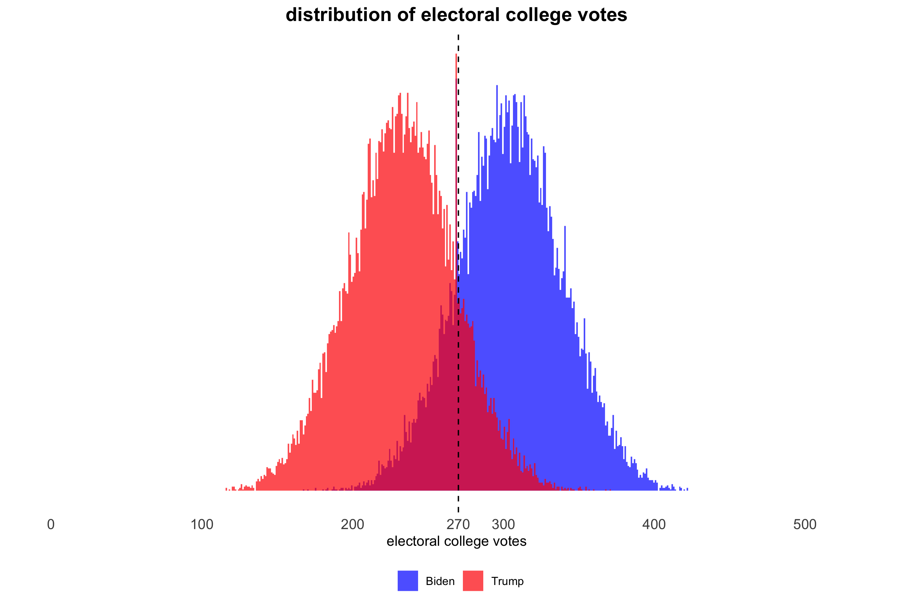

---
output:
  github_document
---

# yapa


# Model 

# Results

```{r some code, message = FALSE, warning = FALSE}
# Fit model and produce results
source("R/fit.R")
```

<center> 

{height=800px, width=700px}

{height=600px, width=600px}

</center>
